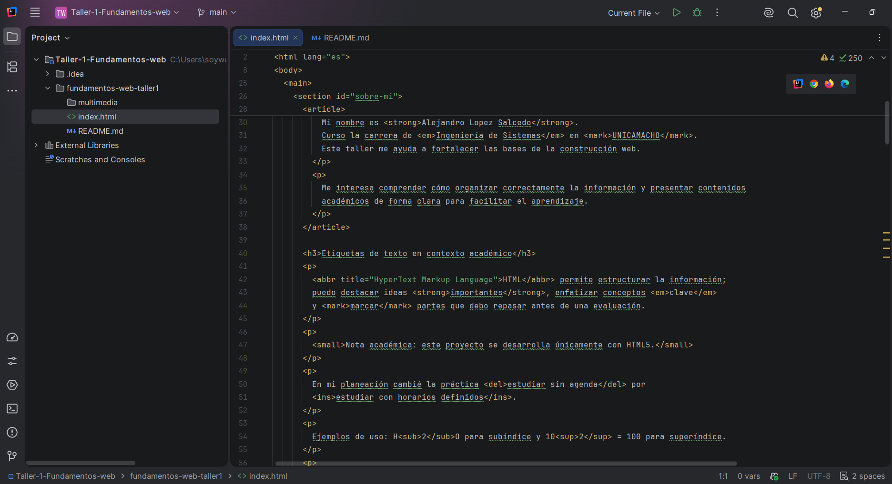

# Taller 1 - Fundamentos Web

Nombre:
Alejandro Lopez Salcedo

Carrera:
Ingeniería de Sistemas

Institución:
UNICAMACHO

Este proyecto tiene como objetivo construir una página web usando únicamente HTML5.

## Estructura del proyecto

```text
fundamentos-web-taller1/
│
├── index.html
├── README.md
│
└── multimedia/
    ├── imagen1.jpg
    ├── imagen2.jpg
    ├── audio.mp3
    └── video.mp4
```

Si los archivos multimedia aún no existen, debes colocarlos manualmente dentro de `multimedia/` con esos nombres exactos para que las rutas del HTML funcionen.

## Elementos HTML utilizados

Se utilizaron elementos estructurales y semánticos como `header`, `nav`, `main`, `section`, `article`, `aside` y `footer`.

También se incluyeron etiquetas de texto (`strong`, `em`, `mark`, `small`, `del`, `ins`, `sub`, `sup`, `abbr`), listas (`ul`, `ol`, `dl`), multimedia (`img`, `audio`, `video`, `iframe`), tabla (`table`, `caption`, `thead`, `tbody`, `tr`, `th`, `td`) y formulario (`input`, `select`, `textarea`, `fieldset`, `legend`, `button`).

Además, se agregaron `details`, `summary`, `time`, `address`, `hr`, `br`, `pre`, `code`, `kbd`, `progress` y `meter` para demostrar variedad de uso de HTML5.

## Respuestas del taller

**¿Qué información aparece dentro de la ventana del navegador?**  
Aparece el contenido del `body`: encabezado, navegación, secciones, listas, multimedia, tabla, formulario y pie de página.

**¿Dónde se observa el contenido de `<title>`?**  
Se observa en la pestaña del navegador (o en el título de la ventana), no dentro del contenido visible del `body`.

**¿Qué diferencia hay entre `<video>` e `<iframe>`?**  
`<video>` reproduce archivos multimedia directamente en la página usando rutas de archivos de video.  
`<iframe>` incrusta un recurso o documento externo completo dentro de la página.

**Diferencia conceptual entre `<progress>` y `<meter>`.**  
`<progress>` representa el avance de una tarea en curso (por ejemplo, porcentaje de un taller).  
`<meter>` representa una medición dentro de un rango conocido (por ejemplo, nivel de concentración de 0 a 10).

**¿Para qué sirve `target="_blank"` en enlaces?**  
Sirve para abrir el enlace en una pestaña o ventana nueva del navegador. Se usa cuando no se quiere reemplazar la página actual.

## Cita utilizada en el proyecto

Cita corta y real incluida:

> "Cool URIs don't change."

Autor/Fuente: Tim Berners-Lee, W3C  
URL de referencia: https://www.w3.org/Provider/Style/URI

## Verificación de código

### Caso A
Problema identificado:
Se usó `href` en la etiqueta `img`, pero `img` no usa `href` para la ruta de imagen.

Corrección realizada:
Se cambió por `src`.

Código corregido:
```html

```

Fuente consultada:
https://developer.mozilla.org/es/docs/Web/HTML/Element/img

### Caso B
Problema identificado:
Se usó `src` en la etiqueta `a`, pero los enlaces usan `href`.

Corrección realizada:
Se cambió `src` por `href`.

Código corregido:
```html
<a href="https://developer.mozilla.org/">Consultar MDN</a>
```

Fuente consultada:
https://developer.mozilla.org/es/docs/Web/HTML/Element/a

### Caso C
Problema identificado:
Dentro de `source` se usó `href`, pero para multimedia se usa `src`.

Corrección realizada:
Se cambió `href` por `src`.

Código corregido:
```html
<video controls>
  <source src="multimedia/video.mp4" type="video/mp4">
</video>
```

Fuente consultada:
https://developer.mozilla.org/es/docs/Web/HTML/Element/source

### Caso D
Problema identificado:
`type="correo"` no es un valor válido para `input` en HTML.

Corrección realizada:
Se usa `type="email"` para correos electrónicos.

Código corregido:
```html
<form>
  <input type="email" name="correo">
</form>
```

Fuente consultada:
https://developer.mozilla.org/es/docs/Web/HTML/Element/input/email

### Caso E
La afirmación es:
Incorrecta.

Justificación:
La etiqueta estándar para insertar imágenes es ``, no `<image>`. Además, `` es un elemento vacío, por lo que no se cierra con `</img>`.

Código HTML funcionando:
```html

```

Fuente consultada:
https://html.spec.whatwg.org/multipage/embedded-content.html#the-img-element
